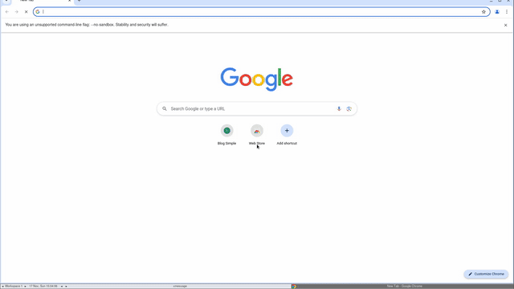

# Chromate Docker Configuration

This section explains how to configure and test the Chromate gem using Docker with xvfb support.



## Docker Setup

To simplify the setup process, Chromate includes a Dockerfile and an entrypoint script that handle the installation and configuration of necessary dependencies, including xvfb.

### Dockerfile

The Dockerfile sets up a minimal environment with all the necessary dependencies to run Chromate in headless mode with xvfb. It installs Chrome, xvfb, and other required libraries.

### 

docker-entrypoint.sh


The entrypoint script ensures that xvfb is running before starting the main process. It removes any existing lock files, starts xvfb and a window manager (fluxbox), and waits for xvfb to initialize.

### How to Use

1. **Build the Docker Image**

   ```sh
   docker build -f dockerfiles/Dockerfile -t chromate .
   ```

2. **Run the Docker Container**

   ```sh
   docker run -v $(pwd)/docker_root:/app -it chromate
   ```

   This command mounts the current directory to `/app` inside the container and starts an interactive bash session.

3. **Run the Test Script**

   Inside the Docker container, run the test script:

   ```sh
   ruby app.rb
   ```

## Conclusion

This setup ensures that all necessary dependencies are installed and configured correctly, allowing you to focus on writing your automation scripts without worrying about the underlying environment.